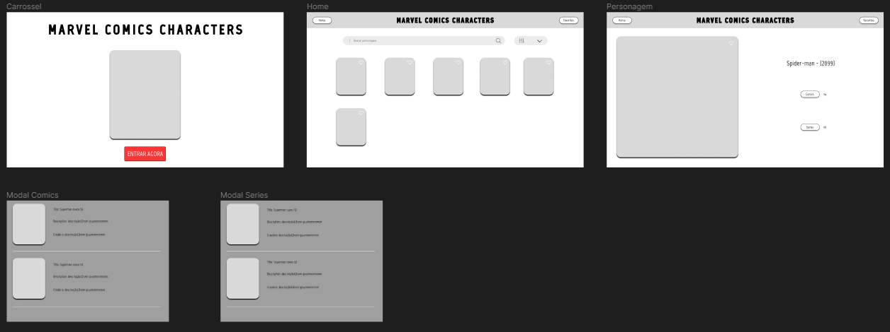

### Sumário

:o: [Contribuidores](#contribuidores)

:o: [Tecnologias](#tecnologias)

:o: [Protótipo Figma](#protótipo-figma)

:o: [Requisitos de Projeto](#requisitos-do-projeto)

:o: [Link do deploy](#link-do-deploy)

:o: [Dicas de acesso](#dicas-de-acesso-arrow_forward)

## Contribuidores

|  |
| ----------------------------------------------------------------------------------------------------------------- |
| [Christian Oliveira](https://github.com/christiandoramo)                                                          |

 

## Tecnologias

     

 

## Protótipo Figma

[Link do figma](https://www.figma.com/file/wM0UP7UBtPNJk6sbAH87aw/Marvels-Comics-Mini-Wiki?type=design&node-id=0%3A1&mode=design&t=dVZIT831B0SCwkUC-1)

 

## Requisitos do Projeto

### Requisitos funcionais

:pushpin: **REQ1** - deve poder voltar em todas as paginas

:pushpin: **REQ2** - deve poder fechar qualquer modal

:pushpin: **REQ3** - navegação da page com componente carrossel para home

:pushpin: **REQ4** - navegação de page home para page personagem

:pushpin: **REQ5** - dentro de perfil pode se abrir um modal com as comics ou series ao clickar em ver comics ou series - o modal possui todos as comics ou series e suas informações

:pushpin: **REQ6** - em Home deve ser usado os limits, counts,offset, para listar os personagem buscados ou renderizados sem input na busca ao apertar enter(ou clickar) para buscar

:pushpin: **REQ7** - em Home podem ser aplicado filtros (com base nos personagens ja achados, nao precisa fazer nova requisição - pode filtrar por range de maior numero de comics por exemplo)

### Requisitos não funcionais

:pushpin: **REQ1** - usuário pode navegar livremente pelo site - (até um máximo de 3000 requisições diárias feitas pelo site)

:pushpin: **REQ2** - deve ser usado os limits, counts e offsets na pagina home, e no modal de comics

:pushpin: **REQ3** - perfil do personagem com suas informações

:pushpin: **REQ4** - perfil do personagem deve ter botão para ver comics e/ou series com o personagem

 

## Roteiro de atividades

### Tarefas iniciais do projeto (entrega 1):

- ~~Criar projeto next~~
- ~~Criar ambiente virtual e primeiro teste com serviçoes e credenciais~~
- ~~Criar requisitos e roteiro de atividades até entrega final~~
- ~~Criar readme navegavel dividido em requisitos, como rodar/acessar, apresentação, colaboradores, indice, protótipo figma, imagens do projeto, o passo a passo/cronograma do que fiz - inserir checklist no readme com essas atividades~~
- ~~Iniciar protótipo figma simples~~
- ~~Prototipar page do carrossel~~
- ~~Prototipar page do home~~
- ~~Prototipar page do pesonagem~~
- ~~Prototipar modal de comic~~
- ~~Prototipar modal de serie~~

### Funcionalidades (entrega 2):

- ~~Deixar funcional (sem estilos) page de Home~~
- ~~Deixar funcional (sem estilos) page do personagem~~
- ~~Deixar funcional (sem estilos) modal de comic~~
- ~~Deixar funcional (sem estilos) modal de serie~~
- ~~Deixar funcional (sem estilos) componente carrossel~~

### Finalizações (entrega 3):

- ~~Page de Home Concluída (estilizada)~~
- ~~Page do personagem Concluída (estilizada)~~
- ~~Modal da comic Concluída (estilizada)~~
- ~~Modal da serie Concluída (estilizada)~~
- ~~Componente carrossel Concluída (estilizada)~~
- ~~Primeiro Deploy~~

### EXTRA-PLUS:

- ~~Novas formas de busca~~
- ~~Novas formas de Navegação~~
- Recursos de acessibilidade (leitura de tela, tema noturno)
- Versão mobile carrossel
- Versão mobile page de Home
- Versão mobile Page do personagem
- Versão mobile Modal da comic
- Versão mobile Modal da serie

 

## Link do deploy

https://marvel-comics-mini-wiki.vercel.app/

 

## Dicas de Acesso :arrow_forward:

usar git clone do projeto de preferencia em ambiente linux ou WSL para windows

inserir na raiz do projeto um arquivo chamda .env.local com as mesmas informacoes que o .env.example

pode-se adquirar a chave publica e privada da marvel aqui: https://developer.marvel.com

De preferencia usar a versao do node no .tool-versions na raiz do projeto (nodejs 18.18.2)
(sugestão usar - gerenciador de versões como asdf ou nvm, e selecionar a versão node acima)

Para instalar pnpm: npm install -g pnpm

Para instalar pacotes - pnpm install

Para rodar o projeto - pnpm run dev

 

### Sumário

:o: [Contribuidores](#contribuidores)

:o: [Tecnologias](#tecnologias)

:o: [Protótipo Figma](#protótipo-figma)

:o: [Requisitos do Projeto](#requisitos-do-projeto)

:o: [Link do deploy](#link-do-deploy)

:o: [Dicas de acesso](#dicas-de-acesso-arrow_forward)

