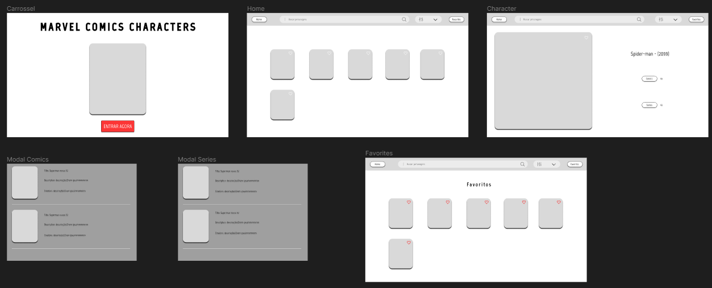

### Sumário

:o: [Contribuidores](#contribuidores)

:o: [Protótipo Figma](#protótipo-figma)

:o: [Requisitos de Projeto](#requisitos-do-projeto)

:o: [Dicas de acesso](#dicas-de-acesso-arrow_forward)

:o: [Link do deploy](#link-do-deploy)

## Contribuidores

|    |
| --------------------------------------------------------------------------------------------------------- |
| [Christian Oliveira](https://github.com/christiandoramo)                                                             |                                
 

## Protótipo Figma 
[Link do figma](https://www.figma.com/file/wM0UP7UBtPNJk6sbAH87aw/Marvels-Comics-Mini-Wiki?type=design&node-id=0%3A1&mode=design&t=dVZIT831B0SCwkUC-1)

 

## Requisitos do Projeto

### Requisitos funcionais

:pushpin: **REQ1** - deve poder voltar em todas as paginas

:pushpin: **REQ2** - deve poder fechar qualquer modal

:pushpin: **REQ3** - navegação da page com componente carrossel para home

:pushpin: **REQ4** - navegação de page home para page personagem

:pushpin: **REQ5** - dentro de perfil pode se abrir um modal com as comics ou series ao clickar em ver comics ou series - o modal possui todos as comics ou series e suas informações

:pushpin: **REQ6** - em Home deve ser usado os limits, counts,offset, para listar os personagem buscados ou renderizados sem input na busca ao apertar enter(ou clickar) para buscar

:pushpin: **REQ7** - em Home podem ser aplicado filtros (com base nos personagens ja achados, nao precisa fazer nova requisição - pode filtrar por range de maior numero de comics por exemplo)

### Requisitos não funcionais

:pushpin: **REQ1** - usuário pode navegar livremente pelo site - (até um máximo de 3000 requisições diárias feitas pelo site)

:pushpin: **REQ2** - deve ser usado os limits, counts e offsets na pagina home, e no modal de comics

:pushpin: **REQ3** - perfil do personagem com suas informações

:pushpin: **REQ4** - perfil do personagem deve ter botão para ver comics e/ou series com o personagem

 

## Roteiro de atividades

### Tarefas iniciais do projeto (entrega 1):

-   ~~Criar projeto next~~
-   ~~Criar ambiente virtual e primeiro teste com serviçoes e credenciais~~
-   ~~Criar requisitos e roteiro de atividades até entrega final~~
-   ~~Criar readme navegavel dividido em requisitos, como rodar/acessar, apresentação, colaboradores, indice, protótipo figma, imagens do projeto,  o passo a passo/cronograma do que fiz - inserir checklist no readme com essas atividades~~
-   ~~Iniciar protótipo figma simples~~
-   ~~Prototipar page do carrossel~~
-   ~~Prototipar page do home~~
-   ~~Prototipar page do pesonagem~~
-   ~~Prototipar modal de comics~~
-   ~~Prototipar modal de series~~

### Funcionalidades (entrega 2):

-   Iniciar (funcional sem estilo) page de Home
-   Iniciar (funcional sem estilo) page do personagem
-   Iniciar (funcional sem estilo) page da comic
-   Iniciar (funcional sem estilo) componente carrossel

### Finalizações (entrega 3):

-   Page de Home Concluída
-   Page do personagem Concluída
-   Page da comic Concluída
-   Componente carrossel Concluída

#### Extra (caso houver tempo - entrega 4):
-   criar favoritar
-   prototipar page favoritos
-   page favoritos funcional (sem estilos)
-   page favoritos concluída

 

## Dicas de Acesso :arrow_forward:

Usar node com está no .tool-versions (nodejs 18.18.2)
(sugestão usar - gerenciador de versões como asdf ou nvm, e selecionar a versão node acima)

Para instalar pnpm: npm install -g pnpm 

Para instalar pacotes - pnpm install

Para rodar o projeto - pnpm run dev

## Link do deploy

### Sumário

:o: [Contribuidores](#contribuidores)

:o: [Protótipo Figma](#protótipo-figma)

:o: [Requisitos do Projeto](#requisitos-do-projeto)

:o: [Dicas de acesso](#dicas-de-acesso-arrow_forward)

:o: [Link do deploy](#link-do-deploy)

